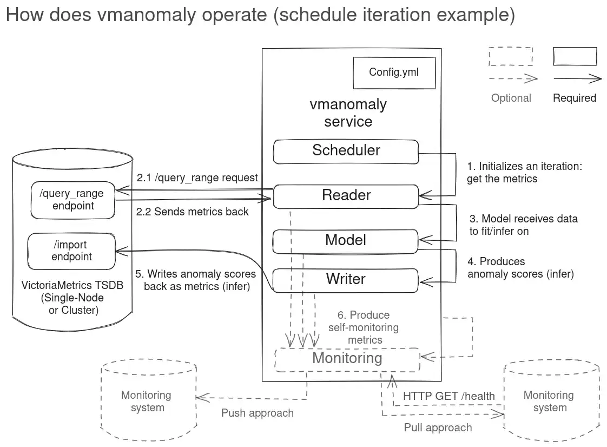

This chapter describes different components, that correspond to respective sections of a config to launch VictoriaMetrics Anomaly Detection (or simply [`vmanomaly`](../Overview.md)) service:

- [Model(s) section](./models.md) - Required
- [Reader section](./reader.md) - Required
- [Scheduler(s) section](./scheduler.md) - Required
- [Writer section](./writer.md) - Required
- [Monitoring section](./monitoring.md) -  Optional

> **Note**: starting from [v1.7.0](../CHANGELOG.md#v172), once the service starts, automated config validation is performed. Please see container logs for errors that need to be fixed to create fully valid config, visiting sections above for examples and documentation.

> **Note**: starting from [v1.13.0](../CHANGELOG.md#v1130), components' class can be referenced by a short alias instead of a full class path - i.e. `model.zscore.ZscoreModel` becomes `zscore`, `reader.vm.VmReader` becomes `vm`, `scheduler.periodic.PeriodicScheduler` becomes `periodic`, etc. Please see according sections for the details.

> **Note:** Starting from [v1.13.0](../CHANGELOG.md#v1130) `preset` modes are available for `vmanomaly`. Please find the guide [here](../Presets.md).

Below, you will find an example illustrating how the components of `vmanomaly` interact with each other and with a single-node VictoriaMetrics setup.

> **Note**: [Reader](./reader.md#vm-reader) and [Writer](./writer.md#vm-writer) also support [multitenancy](../../Cluster-VictoriaMetrics.md#multitenancy), so you can read/write from/to different locations - see `tenant_id` param description.

{width="800px"}

Here's a minimalistic full config example, demonstrating many-to-many configuration (actual for [latest version](../CHANGELOG.md)):

```yaml
# how and when to run the models is defined by schedulers
# https://docs.victoriametrics.com/anomaly-detection/components/scheduler/
schedulers:
  periodic_1d:  # alias
    class: 'periodic' # scheduler class
    infer_every: "30s"
    fit_every: "10m"
    fit_window: "24h"
  periodic_1w:
    class: 'periodic'
    infer_every: "15m"
    fit_every: "1h"
    fit_window: "7d"

# what model types and with what hyperparams to run on your data
# https://docs.victoriametrics.com/anomaly-detection/components/models/
models:
  zscore:  # alias
    class: 'zscore'  # model class
    z_threshold: 3.5
    provide_series: ['anomaly_score']  # what series to produce
    queries: ['host_network_receive_errors']  # what queries to run particular model on
    schedulers: ['periodic_1d']  # will be attached to 1-day schedule, fit every 10m and infer every 30s
  prophet: # alias
    class: 'prophet'
    provide_series: ['anomaly_score', 'yhat', 'yhat_lower', 'yhat_upper']
    queries: ['cpu_seconds_total']
    schedulers: ['periodic_1w']  # will be attached to 1-week schedule, fit every 1h and infer every 15m
    args:  # model-specific arguments
      interval_width: 0.98

# where to read data from
# https://docs.victoriametrics.com/anomaly-detection/components/reader/
reader:
  datasource_url: "http://victoriametrics:8428/"
  tenant_id: "0:0"
  class: 'vm'
  sampling_period: "30s"  # what data resolution of your data to have
  queries:  # aliases to MetricsQL expressions
    cpu_seconds_total: 'avg(rate(node_cpu_seconds_total[5m])) by (mode)' 
    host_network_receive_errors: 'rate(node_network_receive_errs_total[3m]) / rate(node_network_receive_packets_total[3m])'

# where to write data to
# https://docs.victoriametrics.com/anomaly-detection/components/writer/
writer:
  datasource_url: "http://victoriametrics:8428/"

# enable self-monitoring in pull and/or push mode
# https://docs.victoriametrics.com/anomaly-detection/components/monitoring/
monitoring:
  pull: # Enable /metrics endpoint.
    addr: "0.0.0.0"
    port: 8490
```
